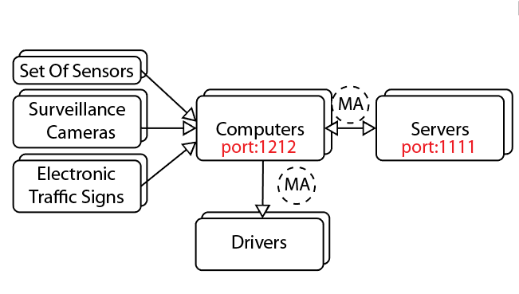
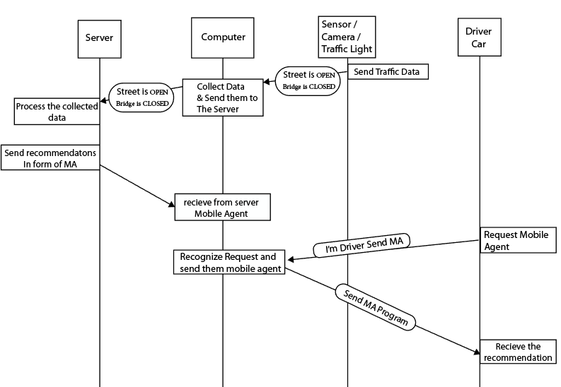

# Distributed-Monitoring-System
 
This system is an IoT System which Computers acts as intermediate layer between the servers and the drivers and also between the servers and the sensors.
The server can’t handle all the requests and response to them. So it gives general recommendations to local computers and computer gives for every mobile a small program ( mobile agent ) that do the repetitive tasks and the automate some requirements. It runs dynamically and autonomously.
Mobile agent reduces latencies and server load by transmitting fewer data to the server. The applications become decentralized not only in servers but also in computers and phones. It also reduces power consumption.
Typical Scenario
1.	The sensors, cameras and traffic lights communicate data to the local computer via Wireless Sensor Network (WSN).
2.	The drivers connect to the local computer via the driver’s mobile smart phone application.
3.	The computer collects the data from sensors and gives it to the server.
4.	The server processes the all data and Mobile Agent to the computer.
5.	The computer takes the recommendations and gives the driver’s phone a mobile agent program have the recommendation for the driver.
6.	The mobile agent application gives instructions and suggestions to the driver.

## System Architecture

## The ALP Diagram

